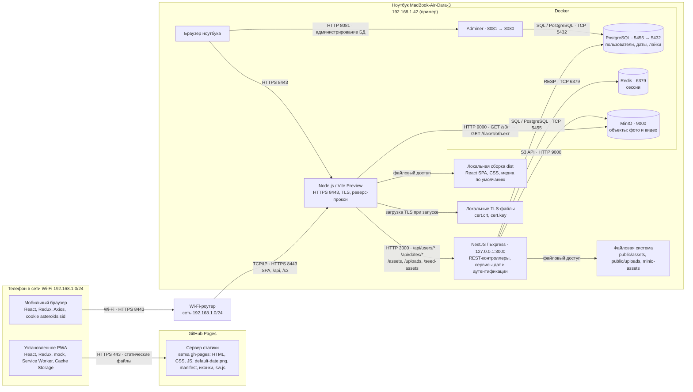

# Диаграмма развёртывания Asteroid Dates

```mermaid
flowchart LR
    subgraph mobile["Телефон в сети Wi‑Fi 192.168.1.0/24"]
        pwa["Установленное PWA<br/>React, Redux, mock, Service Worker, Cache Storage"]
        browser["Мобильный браузер<br/>React, Redux, Axios, cookie asteroids.sid"]
    end

    subgraph github["GitHub Pages"]
        static["Сервер статики<br/>ветка gh-pages: HTML, CSS, JS, default-date.png, manifest, иконки, sw.js"]
    end

    wifi["Wi‑Fi-роутер<br/>сеть 192.168.1.0/24"]

    subgraph laptop["Ноутбук MacBook-Air-Dara-3<br/>192.168.1.42 (пример)"]
        desktop["Браузер ноутбука"]
        proxy["Node.js / Vite Preview<br/>HTTPS 8443, TLS, реверс-прокси"]
        bundle["Локальная сборка dist<br/>React SPA, CSS, медиа по умолчанию"]
        nest["NestJS / Express · 127.0.0.1:3000<br/>REST-контроллеры, сервисы дат и аутентификации"]
        assets["Файловая система<br/>public/assets, public/uploads, minio-assets"]
        certs["Локальные TLS-файлы<br/>cert.crt, cert.key"]

        subgraph docker["Docker"]
            pg[("PostgreSQL · 5455 → 5432<br/>пользователи, даты, лайки")]
            redis[("Redis · 6379<br/>сессии")]
            minio[("MinIO · 9000<br/>объекты: фото и видео")]
            adminer["Adminer · 8081 → 8080"]
        end
    end

    pwa -->|"HTTPS 443 · статические файлы"| static
    browser -->|"Wi‑Fi · HTTPS 8443"| wifi
    wifi -->|"TCP/IP · HTTPS 8443<br/>SPA, /api, /s3"| proxy
    desktop -->|"HTTPS 8443"| proxy
    desktop -->|"HTTP 8081 · администрирование БД"| adminer
    proxy -->|"файловый доступ"| bundle
    proxy -->|"загрузка TLS при запуске"| certs
    proxy -->|"HTTP 3000 · /api/users/*, /api/dates/*<br/>/assets, /uploads, /seed-assets"| nest
    proxy -->|"HTTP 9000 · GET /s3/* → GET /бакет/объект"| minio
    nest -->|"SQL / PostgreSQL · TCP 5455"| pg
    nest -->|"RESP · TCP 6379"| redis
    nest -->|"S3 API · HTTP 9000"| minio
    nest -->|"файловый доступ"| assets
    adminer -->|"SQL / PostgreSQL · TCP 5432"| pg
```

IP ноутбука на схеме приведён для сети показа. Имя телефона определяется в его настройках.
